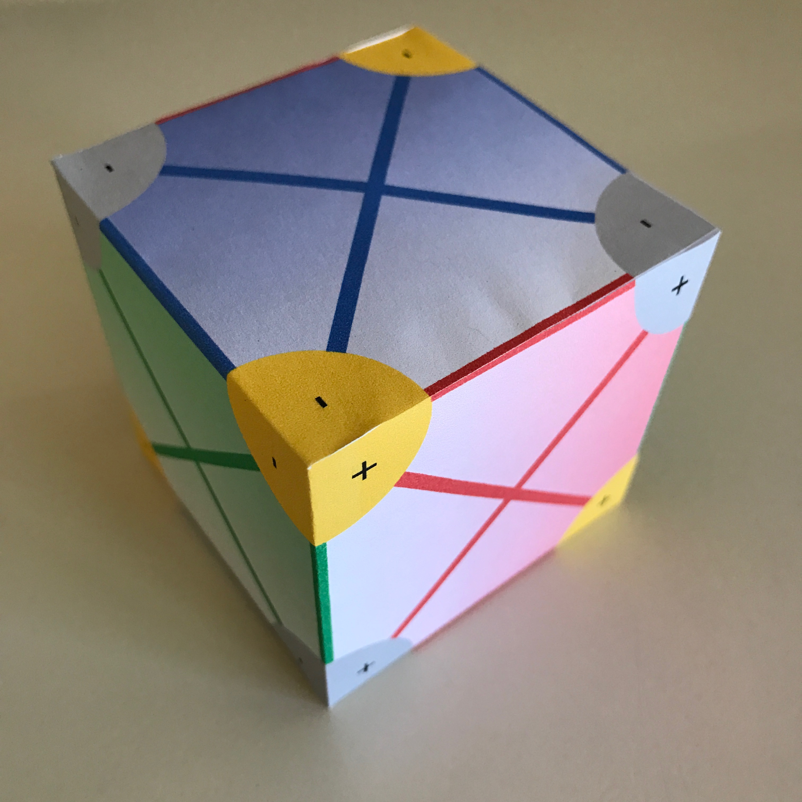
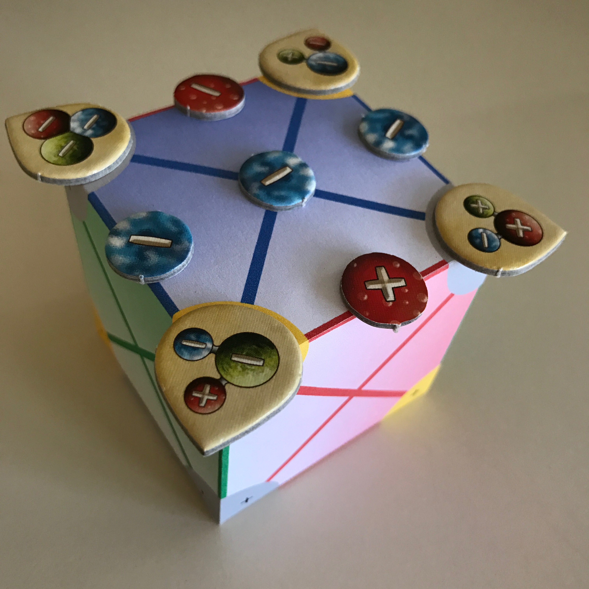

# Alchemists Cube

This repo contains the code for making this:

 

[Opening index.html](https://benjamincosman.github.io/alchemists-cube/) in your browser will run the code from cube.js to create the cube.
[Here](https://boardgamegeek.com/filepage/141895/alchemists-cube-v10) is a
ready-to-print version which also contains an explanation of what this cube is for.

svg.min.js is the production version of the [SVG.js library](https://svgjs.com/docs/2.7/)
